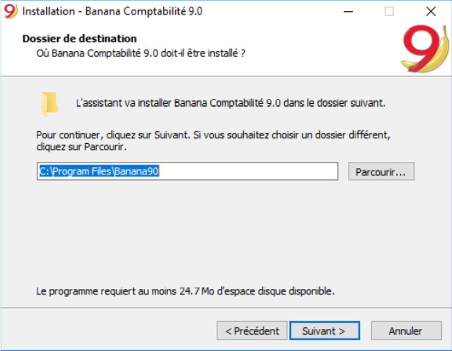
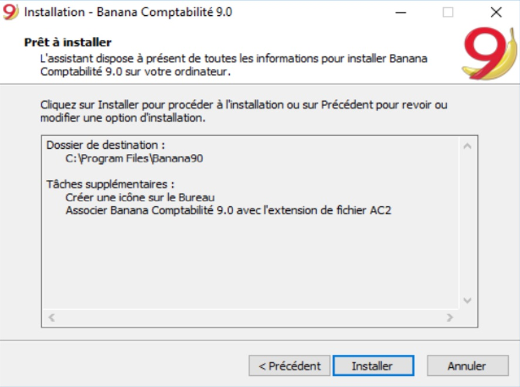
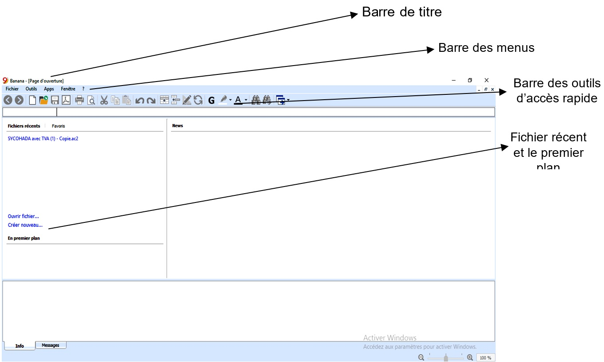

Contenu:

* [A. Fiche Pédagogique](#A-fiche-pédagogique)
    - [1. Objectifs spécifiques](#1-objectifs-spécifiques)
    - [2. Supports](#2-supports)
    - [3. Méthodes et Techniques](#3-méthodes-et-techniques)
    - [4. Durée](#4-durée)
    - [5. Déroulement de l'activité](#5-déroulement-de-l'activité)
* [B. Fiche Technique](#B-fiche-technique)
    - [1. Définition des concepts de base](#1-définition-des-concepts-de-base)
    - [2. Importance du logiciel comptable](#2-importance-du-logiciel-comptable)
    - [3. Caractéristiques du logiciel Banana Comptabilité](#3-caractéristiques-du-logiciel-banana-comptabilité)
    - [4. Présentation du Logiciel Banana Comptabilité](#4-présentation-du-logiciel-banana-comptabilité)

## **Activité 1 : Approche introductive**

### A. **Fiche Pédagogique** 

#### 1.  **Objectifs spécifiques** :

Au terme de cette activité, le participant sera capable de :

- Définir un logiciel comptable ;

-   Donner l'importance et les caractéristiques d'un logiciel comptable ;

-   Présenter le logiciel Banana Comptabilité.

#### 2.  **Supports** :

-   OHADA, Acte uniforme relatif au droit comptable et à l'information financière et système comptable OHADA, YAOUNDE le 15/02/2017 ;

-   Guide d'application OHADA ;

-   EPSP, DIPROMAD, *Curriculum des Humanités Techniques Commerciales*, Commerciale et Gestion, Kinshasa 2014 ;

-   SERNAFOR Technique, module de formation sur le système comptable OHADA niveau 4, 2018 ;

-   [La documentation du logiciel Banana](www.banana.ch/fr/documentation)

#### 3.  **Méthodes et techniques** : 

Exposé, discussion dirigée, brainstorming et travail de groupe.

#### 4.  **Durée** : 

120 minutes

#### 5.  **Déroulement de l'activité** :

| **N°** | **Tâches**                                                                                                                                                                     | **Méthodes et Techniques** | **Durée** |
| ------ | ------------------------------------------------------------------------------------------------------------------------------------------------------------------------------ | -------------------------- | --------- |
| 1      | Présenter l’activité et ses objectifs                                                                                                                                          | Exposé                     | 5 min.    |
| 2      | Définir des concepts de base : logiciel, logiciel comptable                                                                                                                    | Brainstorming              | 15 min.   |
| 3      | Constituer des sous-groupes pour : donner l’importance et les caractéristiques d’un logiciel comptable. Et présenter le logiciel Banana Comptabilité.                          | Travail en groupe          | 60 min.   |
| 4      | En plénière : le rapporteur de chaque sous-groupe présente la production de son équipe suivie de mise en commun avec les membres des autre sous-groupes et du facilitateur.    | Discussion dirigée         | 30 min.   |
| 5      | Questions de synthèse<ul><li>Donner l'importance d'un logiciel comptable</li><li>Citer les caractéristiques d'un logiciel comptable</li><li>Comment lancer le logiciel Banana Comptabilité.</li></ul>  |Discussion dirigée   | 10 min.

### B. **Fiche Technique**

#### 1. Définition des concepts de base

-   **Logiciel :** est un ensemble des programmes, procédés et règles d'un système de traitement informatique des données. Le logiciel détermine donc les tâches qui peuvent être effectuées par la machine, ordonne son fonctionnement et lui procure ainsi son utilité fonctionnelle.

-   **Logiciel comptable** : est un programme informatique permettant d'assurer toutes (ou presque toutes) les tâches de la comptabilité pour établir les états financiers.

Le logiciel de comptabilité est le système d'information comptable.
Il peut être développé spécifiquement par l'entreprise qui l'utilise, ou il peut être acheté à un fournisseur de logiciel, ou être une combinaison d'un ou plusieurs progiciels applicatifs achetés à un fournisseur avec des adaptations locales ou spécifiques. Sa complexité et son coût sont variables en fonction de l'entreprise qui l'utilise.

#### 2. Importance du logiciel comptable

Il enregistre et traite les transactions comptables à l'intérieur de modules fonctionnels comme la comptabilité fournisseurs, la comptabilité clients, la paie et le Grand-livre. Les logiciels comptables permettent des gains considérables de temps par l'utilisation de bases de données mises progressivement à jour par l'entreprise (liste des clients, fournisseurs, articles vendus et achetés...). Les documents comptables peuvent être modifiés et imprimés et par conséquent peuvent être diffusés plus rapidement.

#### 3. Caractéristiques du logiciel Banana Comptabilité

Le logiciel Banana Comptabilité 9 est un logiciel qui, tout en étant
simple à utiliser, offre tous les outils nécessaires pour une
gestion optimale de votre comptabilité.

Il permet de (d') :

-   Préparer le Livre de caisse, le Bilan et le Compte de Résultat, les Décomptes TVA et toutes les impressions fiscales conformément à la législation en vigueur.

Il est idéal pour les agents économiques (entreprises, fiduciaires,
professions libérales, gérants et commerçants) ainsi que pour des
associations sans but lucratif : associations, fondations, club,
patriciats, copropriétés, paroisses et églises, bibliothèques, écoles ainsi que la comptabilité de la cellule familiale. 

-   Obtenir facilement les états financiers avec tous les détails
    nécessaires et les autres documents comptables ;

-   Mettre à jour automatiquement les soldes de comptes au fur et à
    mesure que vous enregistrez vos mouvements. La situation de vos
    comptes est toujours sous contrôle ;

-   Ajouter et supprimer des comptes, modifier des descriptions, créer
    des sous-groupes et divers niveaux de totalisation, même pendant
    l'année ;

-   Contrôler des factures ouvertes et réglées ;

-   Gérer les Clients et Fournisseurs (balance âgée) ;

-   Créer les factures à envoyer à vos clients ;

-   Connaître à tout moment les factures expirées ou ouvertes ;

-   Contrôler et vérifier votre comptabilité à tout moment ;

-   Créer des simulations ;

-   Créer d'innombrables rapports, même par période ;

-   Gérer des projets, secteurs ou activités spécifiques ;

**N.B** : Le logiciel banana est utilisé comme Microsoft Office Excel, mais sans devoir insérer des formules.

Les graphiques ressemblent beaucoup à Excel, mais le logiciel Banana
vous donne l'avantage de ne pas devoir insérer des formules. Très
abordable, il vous offre aussi la possibilité de copier, couper, coller et corriger les données à tout moment.

Lorsque vous saisissez des données, les totaux de tous les tableaux sont mis à jour automatiquement. Sur la base des données insérées, Banana crée immédiatement le bilan, le compte de résultat, les relevés de TVA et de nombreux autres rapports.

#### 4. Présentation du Logiciel Banana Comptabilité

##### a. Lancement du logiciel Banana Comptabilité

Comme tout autre logiciel, le lancement de Banana Comptabilité 9
requiert en amont son installation sur la machine de l'utilisateur.

**Installation du logiciel Banana Comptabilité 9 sur Windows**

Pour installer le programme c'est très simple, grâce à la fonction
d'auto installation. En téléchargeant le programme, vous acceptez les Conditions de licence. Une fois effectué le download (téléchargement), faites un double clic sur le fichier téléchargé.

Le programme propose d'enregistrer dans le dossier C:\Program
Files\Banana90. Si l'on veut enregistrer dans un autre dossier,
cliquer sur le bouton Parcourir et choisir le parcours.

Par défaut, le programme est activé puis crée une icône sur le Bureau et associe Banana Comptabilité 9 avec l'extension de fichier AC2.

Cliquer sur le bouton **Installer** pour démarrer l'installation.

Le programme est installé dans la langue du système d'exploitation de
l'ordinateur, mais la langue peut toujours être modifiée à partir du
menu **Outils,** commande **Options programme**.

Après avoir ouvert le programme insérer la clé de licence et confirmer avec **OK**.

En insérant la clef de licence dans Banana Comptabilité, on passe de la mode de démonstration à la mode complète. Si la clef de licence n'est pas insérée, un message apparaît à l'ouverture du fichier comptable, pour avertir l'utilisateur qu'il travaille en mode **Starter Edition** (version d'essai gratuit limitée à 70 lignes d'écritures).

Après avoir installé le logiciel Banana Comptabilité 9 sur votre
machine, il vous faudrait le démarrer pour l'utiliser :

Cliquer sur bouton Démarrer >> Tous les programmes

Cliquer sur Banana Comptabilité 9.0

Il sied de signaler que lors de l'installation, l'icône du logiciel apparaît automatiquement sur le bureau de l'ordinateur de l'utilisateur. De ce qui précède, il suffit faire un double clic pour lancer le logiciel.

##### b. Créer un nouveau document Banana Comptabilité

Pour créer un nouveau fichier :

-   Démarrez à partir du menu Fichier ;

-   Cliquez sur Nouveau ;

-   Ou en utilisant directement la combinaison des touches (Ctrl+N).

La fenêtre qui apparaît vous donne la possibilité de créer un nouveau
fichier de trois (3) façons différentes :

-   À partir d'un des modèles préconfigurés dans le site internet du logiciel ([www.banana.ch/fr](http://www.banana.ch/fr)) ;

-   En copiant les données d\'un fichier existant (lorsque vous disposez d'un fichier banana) ;

-   À partir d\'un nouveau fichier vide commencez par l\'un de nos  modèles adaptés à votre entreprise.