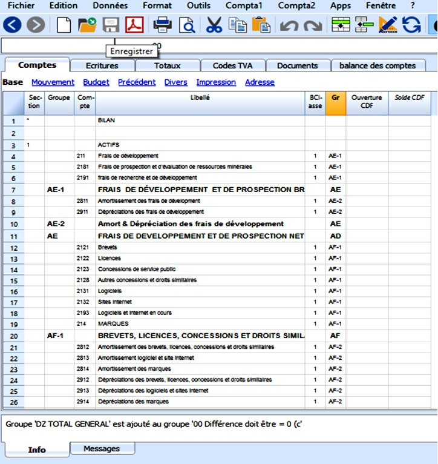
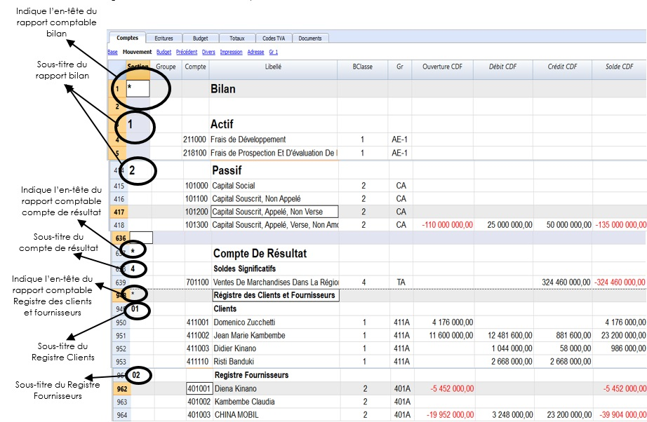
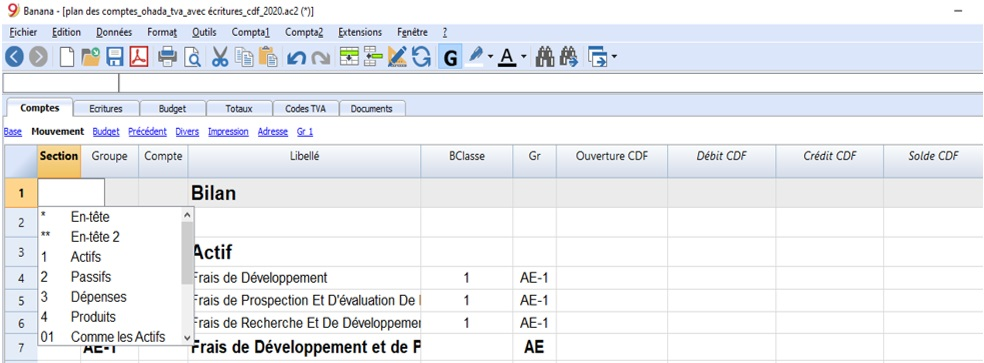

## Activité 2 : Configuration du plan des comptes

Contenu:

* [A. Fiche Pédagogique](#A-fiche-pédagogique)
    - [1. Objectifs spécifiques](#1-objectifs-spécifiques)
    - [2. Supports](#2-supports)
    - [3. Méthodes et Techniques](#3-méthodes-et-techniques)
    - [4. Durée](#4-durée)
    - [5. Déroulement de l'activité](#5-déroulement-de-l'activité)
* [B. Fiche Technique](#B-fiche-technique)
    - [1. Notions](#1-notions)
    - [2. Différents types des lignes et des sections](#2-différents-types-des-lignes-et-des-sections)
    - [3. Explication des colonnes de la comptabilité en partie double](#3-explication-des-colonnes-de-la-comptabilité-en-partie-double)

### A. **Fiche Pédagogique**

#### 1.  **Objectifs spécifiques** :

Au terme de cette activité, le participant sera capable de (d') :

-   Appliquer les notions de configuration d'un plan de compte en utilisant le logiciel banana comptabilité 9 ;

-   Configurer le système de regroupement et de totalisation ;

-   Utiliser la comptabilité en partie double à l'aide du logiciel banana comptabilité 9.

#### 2.  **Supports** :

-   OHADA, Acte uniforme relatif au droit comptable et à l'information financière et système comptable OHADA, Yaoundé le 15 février 2017 ;

-   Guide d'application OHADA ;

-   EPSP, DIPROMAD, *Curriculum des Humanités Techniques Commerciales*, Commerciale et Gestion, Kinshasa 2014 ;

-   SERNAFOR Technique, module de formation sur le système comptable OHADA niveau 4, 2018 ;

-   [La documentation du logiciel Banana](www.banana.ch/fr/documentation)

#### 3.  **Méthodes et techniques** :

Exposé, discussion dirigée, brainstorming et travail de groupe.

#### 4.  **Durée** : 

120 minutes

#### 5.  **Déroulement de l'activité** :

| **N°** | **Tâches**                                                                                                                                                                       | **Méthodes et Techniques** | **Durée** |
| ------ | -------------------------------------------------------------------------------------------------------------------------------------------------------------------------------- | -------------------------- | --------- |
| 1      | Présenter l’activité et ses objectifs                                                                                                                                            | Exposé                     | 5 min     |
| 2      | Expliquer les notions sur la configuration du plan comptable dans le logiciel                                                                                                    | Brainstorming              | 15 min    |
| 3      | Constituer des sous-groupes pour : <ul><li>configurer le système de regroupement et de totalisation ;</li><li>appliquer la comptabilité en partie double à l’aide du logiciel comptable.</li></ul> | Travail en groupe          | 70 min    |
| 4      | En plénière : le rapporteur de chaque sous-groupe présente la production de son équipe suivie de mise en commun avec les membres des autres sous-groupes et du facilitateur.     | Discussion dirigée         | 20 min    |
| 5      | Questions de synthèse<ul><li>Comment configurer le système de regroupement et de totalisation ;</li><li>Expliquer les colonnes de la comptabilité en partiedouble</li></ul>                       | Discussion dirigée         | 10 min    |

### B. **Fiche Technique**

#### 1. Notions

Pendant la présente activité consiste à créer le plan des comptes qui sera ensuite utilisé pour les écritures. La structure du plan comptable permettra d'obtenir en temps réel les États financiers.

Le plan de comptes comprend les colonnes du solde d'ouverture, du mouvement (débit et crédit) et du solde actuel, qui sont ajournés automatiquement par le programme.

#### 2. Différents types des lignes et des sections

Le tableau Comptes (Plan comptable) est à la fois l'outil de
configuration que l'outil pour l'affichage immédiat de la situation économique et financière. Dans le plan comptable, on indique les différents éléments nécessaires pour regrouper les mouvements.

#### 3. Explication des colonnes de la comptabilité en partie double

a. **[Sections](https://www.banana.ch/doc9/fr/node/3384)**: Servent à indiquer les subdivisions du plan de comptes, pour l'impression du Bilan, Compte de Résultat, etc.

Pour marquer la section, il suffit de faire un double clic sur l'une des cellules dans la colonne section afin de sélectionner l'élément de votre choix comme indiqué ci-dessous :

b.  **[Groupes](https://www.banana.ch/doc9/fr/node/3383)**: Sont des lignes de totalisation.

c.  **[Compte](https://www.banana.ch/doc9/fr/node/3978)**: On y insère le numéro de compte.

d.  **Libellé :** Un texte pour indiquer le nom du compte, du groupe ou de la section.

e.  **BClasse :** Indique la nature du compte : 1=Actifs, 2=Passifs, 3=Charges, 4=Produits.

f.  **Gr** : **Totaliser dans la ligne indiquée** : On y indique le code d'un groupe de façon que le programme puisse totaliser cette ligne dans le groupe.

g.  **Solde d'ouverture**: le solde du compte au début de l'année est inséré. Le solde créditeur doit être inséré et précédé par le signe moins (-). Le solde débiteur (en positif). Une différence est indiquée dans la fenêtre d\'information si les soldes d\'ouverture ne sont pas en équilibre, il faut recontrôler la comptabilité (Maj. + F9).

h.  **Mouvement Débit et Crédit**(Colonne protégée) : Le total des mouvements Débit et Crédit sont générés dans le tableau d'écritures.

i.  **Solde (Colonne protégée)** : Le solde du compte inclut le solde d'ouverture et les mouvements Débit et Crédit. Le solde Débiteur est indiqué en positif ; le solde Créditeur est indiqué en négatif (précédé par le signe moins [-]).

j.  **Année précédente**: Le solde du compte à la fin de l'année précédente. Avec les commandes « Créer Nouvelle année » ou « Mettre à jour soldes d'ouverture », les valeurs présentes dans la colonne Solde du fichier de l'année précédente sont reprises. Si une nouvelle comptabilité a été créée et on désire avoir des impressions avec les montants de l'année précédente, les valeurs de l'année précédente doivent être insérées manuellement.

k.  **Colonnes adresses**: Le programme peut [ajouter des colonnes pour les adresses](https://www.banana.ch/doc9/fr/node/4846#colonnes), pour la gestion des données des clients ou des fournisseurs.

Le plan des comptes offre ainsi une vision immédiate et complète de votre situation financière à travers : le bilan, le compte de Résultat, le registre clients et fournisseurs.

