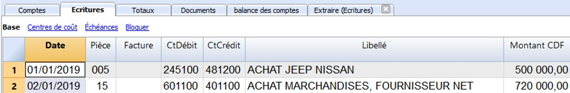

## Activité 3 : Comptabilisation

Contenu:

* [A. Fiche Pédagogique](#A-fiche-pédagogique)
    - [1. Objectifs spécifiques](#1-objectifs-spécifiques)
    - [2. Supports](#2-supports)
    - [3. Méthodes et Techniques](#3-méthodes-et-techniques)
    - [4. Durée](#4-durée)
    - [5. Déroulement de l'activité](#5-déroulement-de-l'activité)
* [B. Fiche Technique](#B-fiche-technique)
    - [1. Notions](#1-notions)

### A. **Fiche Pédagogique**

#### 1.  **Objectifs spécifiques** :

Au terme de cette activité, le participant sera capable de (d') :

-   Expliquer les notions de la comptabilisation à l'aide du logiciel comptable ;

-   Distinguer les types d'écritures dans le logiciel comptable ;

-   Utiliser la comptabilité en partie double avec TVA.

#### 2.  **Supports** :

-   OHADA, Acte uniforme relatif au droit comptable et à l'information financière et système comptable OHADA, Yaoundé le 15 février 2017 ;

-   Guide d'application OHADA ;

-   EPSP, DIPROMAD, *Curriculum des Humanités Techniques Commerciales*, Commerciale et Gestion, Kinshasa 2014 ;

-   SERNAFOR Technique, module de formation sur le système comptable OHADA niveau 4, 2018 ;

-   [La documentation du logiciel Banana](https://www.banana.ch/fr/documentation)

#### 3.  **Méthodes et techniques** :

Exposé, discussion dirigée, brainstorming et travail de groupe.

#### 4.  **Durée** : 

120 minutes

#### 5.  **Déroulement de l'activité** :

|     N°    |     Tâches                                                                                                                                                                              |     Méthodes et Techniques    |     Durée      |
|-----------|-----------------------------------------------------------------------------------------------------------------------------------------------------------------------------------------|-------------------------------|----------------|
|     1     |     Présenter   l’activité et ses objectifs                                                                                                                                             |     Exposé                    |     5 min.     |
|     2     |     expliquer les notions de la comptabilisation à l’aide du logiciel   comptable                                                                                                       |     Brainstorming             |     15 min.    |
|     3     |     Constituer des   sous-groupes pour :     <ul><li>distinguer les types d’écritures;</li><li>utiliser la comptabilité en partie double avec TVA.</li></ul>                                           |     Travail en   groupe       |     70 min.    |
|     4     |     En plénière : le rapporteur de chaque sous-groupe présente la   production de son équipe suivie de mise en commun avec les membres des autre   sous-groupes et du facilitateur.     |     Discussion   dirigée      |     20 min.    |
|     5     |     Questions de   synthèse     <ul><li>citer les types d’écritures utilisés dans logiciel comptable;</li>   <li>expliquer la comptabilité en partie double avec TVA.</li></ul>                             |     Discussion dirigée        |     10 min.    |

### B. **Fiche Technique**

#### 1. Notions

##### 1.1 Soldes d'ouvertures

Quand on utilise Banana Comptabilité pour la première fois, il est
nécessaire d'insérer les soldes initiaux manuellement pour créer le
bilan d'ouverture. Le **solde d'ouverture** d'un compte est indiqué
dans la colonne **Ouverture**:

a. Se positionner dans le tableau **Comptes**, vue **Base**,
    colonne **Ouverture**;

b. Reporter manuellement les soldes initiaux des comptes Actifs et
    Passifs. **Les soldes débiteurs sont indiqués normalement. Les soldes créditeurs sont indiqués avec le signe moins (en négatif)**;

c. Contrôler que le total Actifs est égal au total Passifs pour avoir l'équilibre comptable. Dans le cas qu'il y a des différences dans les soldes d'ouverture, il faut [**contrôler et corriger**](https://www.banana.ch/doc9/fr/node/7220).

Pour reporter automatiquement les soldes d'ouverture pour l'année
suivante, cliquer sur menu compta 2 puis cliquer sur créer une nouvelle
année.

##### 1.2 Mise à jour des soldes d'ouverture

La commande **Mettre à jour Soldes d'ouverture :**

-   Reprend les données de clôture du fichier indiqué.

-   Copie les données de l\'année précédente dans le fichier courant (voir commande [Créer nouvelle année](https://www.banana.ch/doc9/fr/node/3398#2))

La commande n'influence pas les écritures déjà insérées. En fait, c'est comme si on crée une nouvelle année et on enregistre dans l'année courante.

La commande **Mettre à jour Soldes d'ouverture**est nécessaire dans les cas suivants :

- Si on a créé une nouvelle année et par après on a fait d'ultérieures écritures ou corrections dans l'année précédente ;

- Quand le bénéfice ou la perte de l'exercice n'a pas été reparti.

La procédure de mise à jour est la suivante :

- Ouvrir le fichier de l'année courante et du menu **Compta2**, cliquer sur la commande **Mettre à jour soldes d'ouverture**

- Spécifier le fichier de l'année précédente, avec le bouton **Parcourir**

- Suivre les mêmes instructions que celles pour la commande **Créer nouvelle année**.

##### 1.3 Écritures de l'année

Il s'agit d'insérer les écritures dans le journal. Les écritures doivent être insérées dans le **Tableaux Écritures**.

##### 1.4 Commentaire sur les colonnes du tableau d'Écritures

a. **Date :** La date doit être située dans la période comptable définie dans les [Données de base](https://www.banana.ch/doc9/fr/node/2864) de la comptabilité. Dans les [options](https://www.banana.ch/doc9/fr/node/2865) on peut indiquer que la date est obligatoire, autrement la valeur peut être vide. S'il y a des [écritures bloquées](https://www.banana.ch/doc9/fr/node/3168), le programme signale une erreur quand on insère une date inférieure ou égale à la date du bloc. 

b. **Pièce :** Le numéro du justificatif qui est la base pour l'écriture comptable. En introduisant les écritures, il est conseillé d'indiquer un numéro progressif sur le document, de façon à ce que l'on peut facilement retrouver la pièce comptable. La fonction de saisie semi-automatique suggère des valeurs progressives et des codes d'écriture définis précédemment dans le tableau Écritures répétées. Le programme propose le numéro suivant du document, qui peut être repris avec la touche **F6**.

- Numérotation numérique, le programme incrémente simplement la valeur plus élevée trouvée dans la **colonne Doc ;**

- Numérotation alphanumérique, le programme incrémente la partie numérique finale ; cette fonction est utile si l'on veut tenir des numérotations séparées pour la caisse ou la banque.

    -   Si précédemment C-01a été inséré, et on commence à taper C, le
        programme propose C-02.

    -   Si précédemment B104 a été inséré, et on commence à taper B, le
        programme propose B105.

    -   Si précédemment D10-04 a été inséré, et on commence à taper D,
        le programme propose D10-05.

Dans les écritures répétées vous pouvez prédisposer des groupes d'écritures qui seront reprises au moyen d'un code.

Pour ajouter une grande quantité de numéros, vous pouvez éventuellement
profiter d'Excel. Créez dans Excel la quantité désirée de numéros de
pièces et copier et coller dans la colonne **Pièce** du tableau Ecritures de Banana Comptabilité.

c. **Numéro de la facture :** Un numéro de facture émise ou payée qui est utilisé avec la fonction de contrôle-factures pour clients et fournisseurs.

d. **Lien à fichier externe :** Sert à insérer un lien à un fichier externe, habituellement le justificatif comptable. Avec la petite flèche en haut, le programme ouvre le document. Cette colonne est utilisée avec la commande **Lien à un document**

e. **Libellé :** Le texte de l'écriture. La fonction de saisie semi-automatique suggère le texte d'une écriture déjà insérée, ou insérée l'année précédente si l'option appropriée est active. En pressant la touche **F6**, le programme reprend les données de la ligne précédente avec le même libellé et complète les champs de la ligne actuelle.

f. **Compte Débit :** Le compte qui sera débité.

g. **Compte Débit Description :** La description du compte inséré, reprise du plan comptable

h. **Compte Crédit :** Le compte qui sera crédité. Pour le reste, nous renvoyons l'utilisateur à l'explication sous "**Compte Débit**".

i. **Compte Crédit Description**: La description de ce compte, reprise du plan comptable

j. **Montant :** Le montant qui sera inséré sur le compte Débit et le compte Crédit.

#### 2. Types d'écritures

Avec le logiciel banana comptabilité, vous avez la possibilité de tenir :

-   La Comptabilité en partie double mono-devise sans ou avec TVA ;

-   La Comptabilité en partie double multidevise sans ou avec TVA

-   La Comptabilité en partie double mono-devise sans TVA ;

Il y a généralement deux types d'écritures :

-   Ecritures simples

-   Ecritures composées

##### 2.1 Comptabilité en partie double sans TVA

a. **Écritures simples**

L'écriture simple celle qu'inclue deux comptes qui sont insérés chacun sur une seule ligne. Le numéro de pièce est différent pour chaque écriture.

b. **Écritures composées**

L'écriture composée est celle qui fait intervenir au moins deux comptes
enregistrés sur plusieurs lignes. Le numéro de document reporté sur les
différentes lignes est le même car il s'agit de la même écriture.

**N.B. :** Dans les écritures composées, les dates des lignes de l'écriture doivent être les mêmes, sinon, en cas de calculs par période, il pourrait y avoir des différences comptables.

##### 2.2 Comptabilité en partie double mono devise avec TVA

Les plans comptables de Banana Comptabilité 9 sont déjà configurés avec
les comptes pour la TVA. Si vous n'utilisez pas les plans comptables
préconfigurés de Banana, il est nécessaire de vous assurer que dans
votre plan comptable personnel les comptes TVA soient présents.

Néanmoins, il est possible de convertir généralement un fichier existant
en un autre avec des propriétés différentes. Notamment passer d'un
fichier de plan de comptes sans la déclaration TVA à un autre plan de
comptes avec la déclaration TVA. Pour ce faire, on procède de la manière
suivante :

-   Aller dans la barre de menus puis cliquer sur outils ;

-   Commande convertir fichier ;

-   Enregistrer et indiquer le nom du nouveau fichier.

**N.B.** : Lors de la conversion, il sied de rappeler que les données du
fichier existant restent inchangées. Quand un fichier, contenant plus
d'éléments, est converti dans un fichier avec moins d'informations, une
partie des données sera perdue pendant la conversion. Par exemple, si on
veut convertir une comptabilité avec TVA dans une comptabilité sans TVA,
les données relatives aux colonnes de la TVA seront perdues dans la
conversion.

a.  **Tableau codes TVA**

Les configurations dans le tableau Codes TVA permettent de définir tous
les paramètres nécessaires pour gérer les modalités des écritures avec
TVA. Ces configurations concernent : la TVA due ou à récupérer, le
montant de l'écriture au brut, au net ou montant TVA au 100% (TVA à la
douane), le pourcentage TVA à appliquer, le compte sur lequel la TVA
doit être enregistrée, l'arrondi spécifique pour chaque code ou la
méthode de regroupement et de totalisation.

b.  **Modalité de calcul**

Les paramètres indiqués dans le tableau TVA sont utilisés pour calculer
la TVA des écritures individuelles.

Dans les écritures, on ne peut pas changer les paramètres établis dans
le tableau Codes TVA. Cette modalité assure que les calculs TVA soient
corrects et uniformes.

**N.B:** Si la valeur d'un code TVA, qui a déjà été utilisé dans les
écritures, est modifiée, les modifications ne sont pas directement
reportées, mais il est nécessaire d'activer la commande pour
recontrôler la comptabilité (Menu **Compta1 -> Contrôler comptabilité)**.

Quand on modifie le tableau TVA, par prudence, le programme affiche un
message dans la fenêtre d'information qui invite l'utilisateur à
procéder à un recontrôle complet.

**Le tableau qui suit se réfère aux codes utilisés selon les normes Congolaises**.

c. **Description détaillée des colonnes**

Dans les colonnes suivantes, insérez les données suivantes :

-   **Groupe** : un sigle ou un numéro qui indique le groupe
    d'appartenance.

-   **Cod. TVA** : il y a un code TVA approprié pour chaque type
    d'écriture. Au moment de l'écriture il suffit d'actionner ce code,
    la TVA est comptabilisée automatiquement.

-   **Libellé** : un texte pour la description du code TVA ou du Groupe.

-   **Gr** : sigle du Groupe dans lequel la ligne doit être totalisée.

-   **Gr1** : dans l'image sont présents les regroupements pour la
    codification qui représente les chiffres de la déclaration TVA de la
    Direction Générale des Impôt de la RDC.

-   **TVA due (collectée) :** si dans la cellule de cette colonne
    **Oui** est insérée, ceci veut dire que la TVA est due ou collectée.
    Si rien n'est indiqué, ceci veut dire que la TVA est récupérable.

-   **Montant type** : le code indique comment doit être compris le
    montant de l'écriture.
    
    - (0) Lorsque c'est zéro, la cellule reste vide : la TVA est incluse
    dans le montant de l'écriture ;

    - (1) Le montant de l'écriture est le montant net de la TVA.
    C'est-à-dire c'est le montant hors TVA.

    - (2) Montant TVA le montant de l'écriture est considéré comme
    montant TVA à 100% TVA **%**

-   **Non déd. :** la partie de la TVA qui n'est pas déductible en
    pourcentage. A être utilisé quand la déduction de la TVA n'est pas
    applicable complètement. Les modifications pour ce champ ne sont
    reprises que pour de nouvelles écritures.

-   **% au brut** : d'habitude, cette colonne reste vide. Dans des cas
    particuliers, on doit y insérer **Oui** seulement si le taux TVA
    doit être appliqué sur le montant brut (TVA comprise) et non sur
    l'imposable (par exemple lors de taux de TVA forfaitaires).

-   **Compte TVA** : le numéro de compte sur lequel la TVA calculée est
    enregistrée automatiquement.

Quand les écritures avec TVA sont insérées, en appliquant le code TVA
dans la colonne **Cod. TVA**, le programme calcule automatiquement tous
les montants relatifs à la TVA et les transfère dans le compte TVA.

