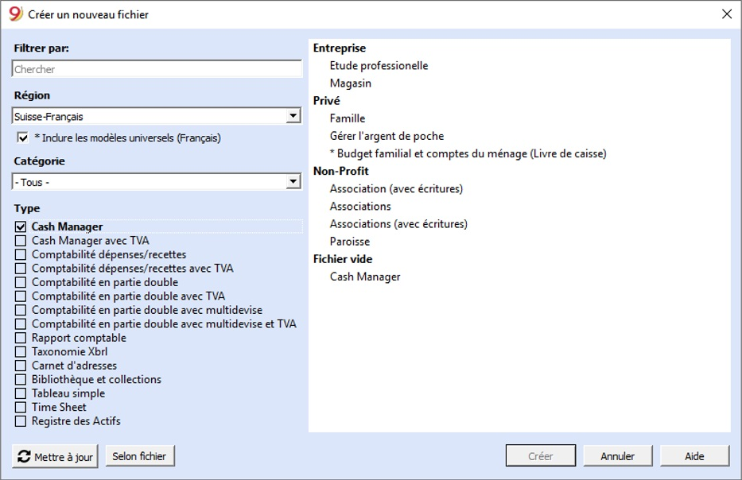
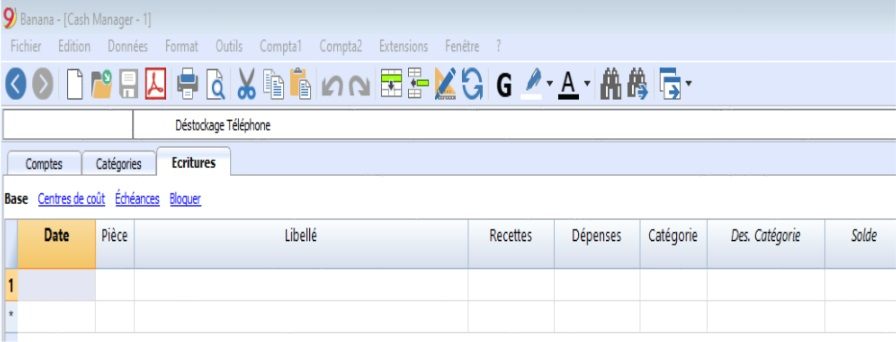
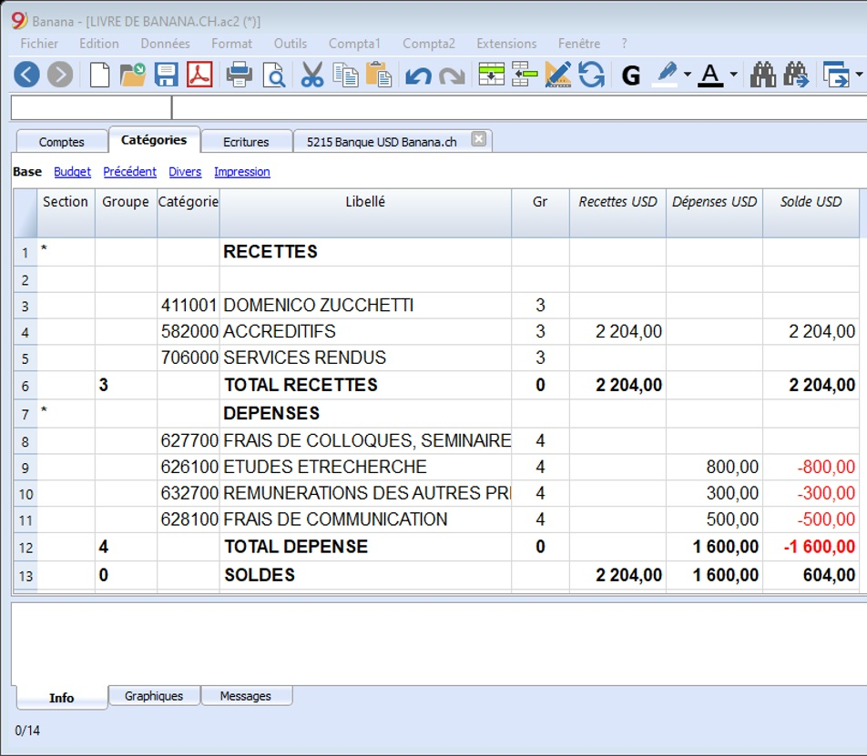
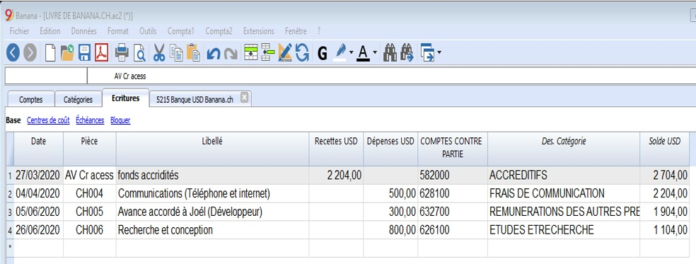
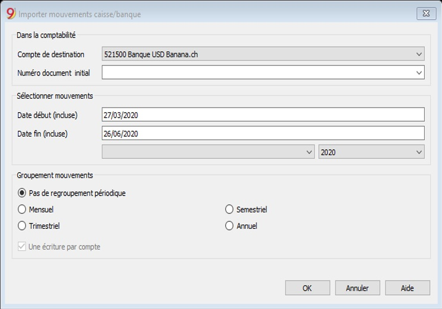

## Activité 5: Gestion de trésorerie

Contenu: 

* [A. Fiche Pédagogique](#A-fiche-pédagogique)
    - [1. Objectifs spécifiques](#1-objectifs-spécifiques)
    - [2. Supports](#2-supports)
    - [3. Méthodes et Techniques](#3-méthodes-et-techniques)
    - [4. Durée](#4-durée)
    - [5. Déroulement de l'activité](#5-déroulement-de-l'activité)
* [B. Fiche Technique](#B-fiche-technique)

### A. Fiche Pédagogique

#### 1. Objectifs spécifiques :

Au terme de cette activité, le participant sera capable capable de (d') :

-   Créer les journaux auxiliaires de la trésorerie (cash manager) avec ou sans TVA ;

-   D'enregistrer les mouvements de la trésorerie ;

-   Importer les mouvements de la trésorerie au journal centralisateur.

#### 2.  Supports :

-   OHADA, Acte uniforme relatif au droit comptable et à l'information financière et système comptable OHADA, Yaoundé le 15 février 2017 ;

-   Guide d'application OHADA ;

-   EPSP, DIPROMAD, *Curriculum des Humanités Techniques Commerciales*, Commerciale et Gestion, Kinshasa 2014 ;

-   SERNAFOR Technique, module de formation sur le système comptable OHADA niveau 4, 2018 ;

-   [La documentation du logiciel Banana](https://www.banana.ch/fr/documentation)

#### 3.  Méthodes et techniques :

Exposé, discussion dirigée, brainstorming et travail de groupe.

#### 4.  Durée : 

120 minutes

#### 5.  Déroulement de l'activité :

| **N°** | **Tâches**                                                                                                                                                                                                                                                                                                                                   | **Méthodes et Techniques** | **Durée** |
| ------ | -------------------------------------------------------------------------------------------------------------------------------------------------------------------------------------------------------------------------------------------------------------------------------------------------------------------------------------------- | -------------------------- | --------- |
| 1      | Présenter l’activité et ses objectifs                                                                                                                                                                                                                                                                                                        | Exposé                     | 5 min.    |
| 2      | <ul><li>Définir les concepts de base : recettes, dépenses, solde ;</li><li>Expliquer :<ul><li>Comment Créer les journaux auxiliaires de la trésorerie (cash manager) avec ou sans TVA ;</li><li>Enregistrer les mouvements de la trésorerie ;</li><li>Importer les mouvements de la trésorerie au journal centralisateur</li></li></ul>                                                                | Brainstorming              | 15 min.   |
| 3      | Constituer des sous-groupes pour : <li>Créer, enregistrer et importer les mouvements de la trésorerie au journal centralisateur à l’aide du logiciel banana comptabilité sur base d’une application.</li>                                                                                                                                             | Travail en groupe          | 70 min.   |
| 4      | En plénière : le rapporteur de chaque sous-groupe présente la production de son équipe suivie de mise en commun avec les membres des autres sous-groupes et du facilitateur.                                                                                                                                                                 | Discussion dirigée         | 20 min.   |
| 5      | Questions de synthèse<ul><li>Distinguer les Encaissements et décaissements,</li><li> Enumérer les colonnes spécifiques du fichier cash manager (avec ou sans TVA) ;</li><li> Décrire le mode opératoire de la création d’un fichier cash manager</li><li>Comment se réalise l’Importation d’un fichier cash manager (avec ou sans TVA) dans le fichier journal centralisateur</li></ul> | Discussion dirigée         | 10 min.   |

### B. Fiche Technique

#### 1. Notions

Le livre de caisse de Banana Comptabilité vous aide à suivre toutes les transactions associées à votre compte caisse ou d banque, y compris les
écritures avec TVA, la trésorerie, les reçus, les paiements, les revenus
et les dépenses.

#### 2. Caractéristiques

-   Gère le compte caisse ou banque ainsi que les dépenses et recettes

-   La typologie avec la TVA permet les calculs de la TVA e les Rapports TVA

-   Elabore toutes les écritures comptables : journal, fiches de compte,

-   Importer ces mouvements au journal de la comptabilité en partie double par période ou annuels

#### 3. Tableaux et Propriétés fichiers

Le Livre de caisse est compris dans la typologie Comptabilité
dépenses/recettes. Il présente les tableaux suivants :

-   **Comptes** : Où se trouvent le compte caisse ou Banque que vous gérez et le solde d'ouverture relatif ;

-   **Catégories** : Où se définissent les catégories pour les dépenses/Recettes ;

-   **Ecritures**: Où l'on insère les mouvements comptables ;

-   **Codes TVA** : Où l'on définit les codes TVA, au cas où vous auriez choisi l'option TVA. En choisissant un des modèles déjà configurés, les codes TVA seront déjà configurés correctement et permettront ainsi d'obtenir automatiquement le facsimile du Formulaire TVA officiels ;

-   **Propriétés fichier** : Où l'on insère les configurations générales relative à la comptabilité.

#### 4. Commencer un Cash Manager

##### 4.1 Créer une comptabilité à partir d'un modèle en ligne

-   Menu **Fichier**, commande **Nouveau ;**

-   Sélectionner la **Région**, la **Catégorie** et la typologie ;

-   Dans la liste des modèles qui apparaît, choisissez celui qui se rapproche le plus de vos besoins ;

-   Cliquer sur le bouton **Créer**.

En insérant un mot clé dans la case "Chercher", le programme affiche
tous les modèles avec le mot clé inséré.

Vous pouvez également démarrer à partir d'un fichier vide en activant
l'option **Créer fichier vide**. Dans tous les cas, afin de faciliter
le démarrage et d'éviter des erreurs de regroupement, nous vous
conseillons de toujours partir d'un modèle existant.

Des informations supplémentaires concernant la création d'un nouveau
fichier sont disponibles sur la page Créer nouveau
fichier.

##### 4.2 Configurer les Propriétés Fichier

Configurez vos propres données dans les Propriétés fichiers (Données de
base)et sauvez le fichier en cliquant Enregistrez sous...

#### 5. Insérer le solde d'ouverture du compte caisse ou banque

Dans le tableau Compte, insérez le compte à gérer et dans la colonne
Ouverture, insérez le solde initial. Avec le passage à la nouvelle
année , avec la commande Créer Nouvelle année du menu Compta2, le solde
d'ouverture sera automatiquement reporté. Il n'est pas possible d'insérer plus qu'un compte.

A ce niveau, le problème majeur est de savoir configurer les catégories
recettes et dépense.

#### 6. Catégories

Dans le tableau Catégories on y insère les données des dépenses et des
recettes en regroupements principaux, qui peuvent à leur tour contenir
des sous-groupes. L'ensemble des catégories détermine le solde du compte.

#### 7. Regroupement

Dans l'exemple, nous trouvons deux regroupements principaux :

-   Groupe 3 - Totalise toutes les catégories possédant Gr 3 (Total recettes)

-   Groupe 4 - Totalise toutes les catégories possédant Gr 4 (Total dépenses).

-   Groupe 0 - Totalise les groupes 3 et 4 (Total recettes / dépenses) qui déterminent le Résultat d'Exercice.

#### 8. Les colonnes du tableau Catégories

-   **Sections**: Il faut insérer un astérisque dans la ligne où est introduit le titre, qui sera ensuite repris dans le Rapport formaté avec groupes. (Dans notre exemple, l'astérisque est inséré sur la ligne du titre Résultat). Si, en plus des dépenses et recettes il est prévu d'autres sections, par exemples centres de coûts et de profit, dans la colonne Section, toujours sur la ligne du titre, vous pouvez insérer un autre astérisque. De plus amples détails sont disponibles sur la page web Sections.

-   **Groupes**: Ici, un identifiant (un numéro ou un sigle) égal à celui inséré pour chaque catégorie dans la colonne GR. Ceci sert à totaliser les montants de toutes les catégories appartenant aux même GR (dans l'exemple, le Groupe 3 totalise toutes les catégories des recettes et le Groupe 4 totalise toutes les catégories des dépenses).

-   **Libellé**: On y inscrit la description pour identifier la catégorie des recettes et des dépenses.

-   **Gr**: Chaque catégorie possède un identifiant qui sert à définir dans quel groupe il doit être totalisé (dans l'exemple toutes les catégories des recettes contiennent le GR 3, parce que dans le Groupe 3 sont totalisées les recettes.

-   **Recettes**: La colonne est protégée et reporte le solde des écritures des recettes. Après chaque écriture, le solde est automatiquement mis à jour.

-   **Dépenses**: La colonne est protégée et reporte le solde des écritures des dépenses. Après chaque écriture, le solde est automatiquement mis à jour.

-   **Solde**: La colonne est protégée et reporte le solde global des recettes et dépenses. Après chaque écriture, le solde est automatiquement mis à jour

#### 9. Écritures

Les écritures sont insérées dans le Tableau **Écritures**. Pour chaque
opération il faut insérer : la date, le numéro de pièce, le libellé, la
recette ou la dépense, le compte et la catégorie.

-   **Recettes/Dépenses** : le montant des recettes ou des dépenses.

-   **Compte** : insérez un des comptes patrimoniaux (caisse ou banque).

-   **Catégorie** : insérez une catégorie relative aux recettes ou aux dépenses.

**Les colonnes du tableau Ecritures**

-   **Date**: Insérez la date de l'écriture pour les dépenses ou les recettes

-   **Pièce**: Insérez le numéro de la Pièce. En général, on reproduit à cet endroit le même numéro repris sur la pièce justificative en papier ; ceci permet, dans le cours du temps, de retrouver facilement les pièces justificatives.

-   **Libellé**: Insérez ici une description de la transaction pour pouvoir plus facilement identifier votre écriture des dépenses ou des recettes.

-   **Recettes**: Insérez le montant des recettes

-   **Dépenses**: Insérez le montant des dépenses

-   **Catégorie**: Insérez la catégorie des dépenses ou des recettes, définie dans le tableau Catégories.

#### 10. Importer mouvements de la caisse

Dans la comptabilité, on peut gérer la caisse séparément et, à échéances
régulières, y importer les mouvements regroupés selon une période
sélectionnée.  Il s'agit de deux fichiers séparés : un fichier contient
toutes les données de la comptabilité générale, un deuxième fichier
contient seulement les données de la caisse. 

Afin de pouvoir exécuter l'importation des données, il faut établir un
lien qui peut avoir lieu de deux manières différentes :

-   Attribuez aux catégories les mêmes numéros des comptes de la comptabilité en partie double, ou, les mêmes numéros de catégorie de la comptabilité dépenses/recettes (Colonne Catégories) ;

-   Reportez dans la colonne Catégorie2 (tableau Catégories) les mêmes comptes de la comptabilité en partie double ou les comptes des catégories de la comptabilité dépenses/recettes.

**NB :** la colonne Catégorie2 n'est pas présente, il faut l'afficher
à l'aide de la commande **Organiser colonnes**, menu **Données**.

Pour l'importation des données, il faut :

-   Ouvrez le fichier de la comptabilité générale et du menu **Compta1**, cliquez sur la commande **Importer en Comptabilité**.  

-   Dans la fenêtre qui s'ouvre, sélectionnez **Écritures** du menu déroulant **Importer** ; ensuite cliquez sur **"Mouvements Cash Manager(*.ac2)"** et, à l'aide du bouton **Parcourir**, sélectionnez le fichier du Cash Manager.

**Importer en comptabilité**

Il faut sélectionner le numéro de compte (de la comptabilité en partie
double ou de la comptabilité dépenses/recettes) où les données doivent
être reportées.

-   **Numéro de pièce **: C'est le numéro de la pièce justificative que l'on attribue aux écritures reportées.

**Sélectionner mouvements**

-   **Date début / Date fin :** Spécifiez la date initiale et la date finale de la période à laquelle les données importées se réfèrent.

-   **Groupement mouvements**: En activant une des options, vous pouvez choisir comment les mouvements de la période doivent être regroupés : pas de regroupement périodique. Toutes les lignes sont importées, avec les contenus respectifs des colonnes. Le numéro de la Pièce de la caisse est aussi importé. Si dans la comptabilité vous désirez utiliser une numérotation différente, tout en voulant conserver le document original du livre caisse, il faut insérer dans le livre caisse le numéro de la Pièce dans Doc Protocole :

**Mensuel** : regroupe les mouvements par mois

**Trimestriel** : regroupe les mouvements par trimestre

**Semestriel** : regroupe les mouvements par semestre

**Annuel** : regroupe les mouvements par année

**Une écriture par compte**

Si plusieurs catégories sont regroupées dans un compte unique de la
comptabilité, et que vous désirez des écritures séparées pour chaque
catégorie, il faut activer cette case ; le programme crée alors des
écritures pour chaque catégorie. Quand vous utilisez des codes TVA, non
seulement des écritures par catégorie sont créées, mais aussi par codes
TVA différents pour la même catégorie.

**NB :** Il s'agit d'une comptabilité avec TVA, les calculs de la TVA
peuvent résulter légèrement différents. Si les montants des écritures
sont insérés en net, le solde de la caisse peut être différent à cause
des différences d'arrondi.

Le fichier de la comptabilité est mis à jour avec les données de la
caisse. 

