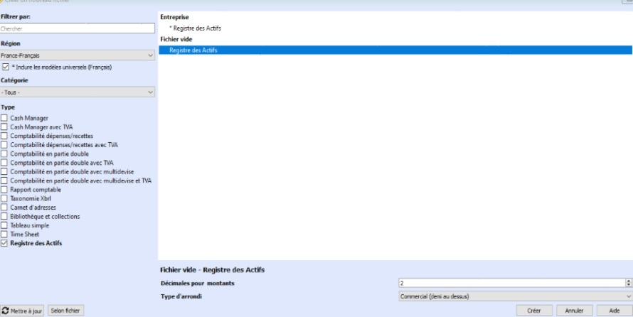
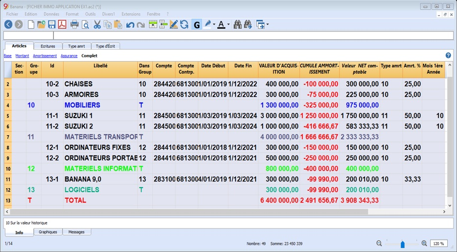
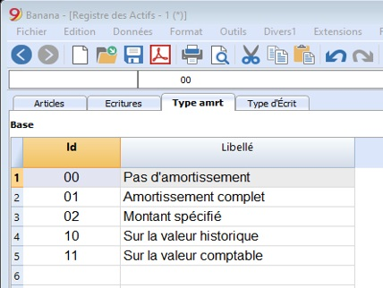
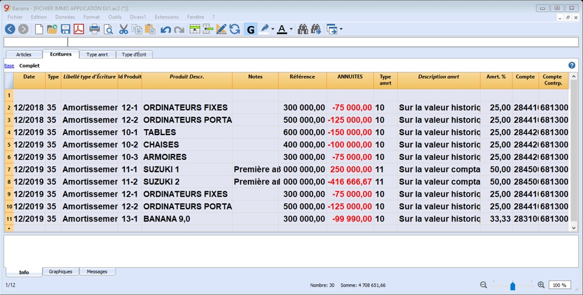
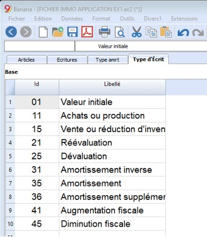
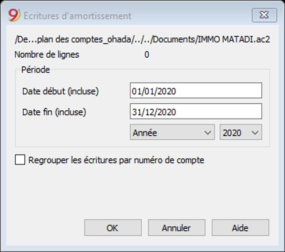

## Activité 6: Gestion des actifs Immobilisés amortissables (Registre des actifs)

Contenu:

* [A. Fiche Pédagogique](#A-fiche-pédagogique)
    - [1. Objectifs spécifiques](#1-objectifs-spécifiques)
    - [2. Supports](#2-supports)
    - [3. Méthodes et Techniques](#3-méthodes-et-techniques)
    - [4. Durée](#4-durée)
    - [5. Déroulement de l'activité](#5-déroulement-de-l'activité)
* [B. Fiche Technique](#B-fiche-technique)
    - [1. Notions](#1-notions)
    - [2. Contenu du registre des biens amortissables](#2-contenu-du-registre-des-biens-amortissables)
    - [3. Tenue du registre des biens amortissables](#3-tenue-du-registre-des-biens-amortissables)
    - [4. Tableau Ecritures](#4-tableau-ecritures)
    - [5. Les colonnes tableau d'écriture amortissement](#5-les-colonnes-tableau-d'écriture-amortissement)
    - [6. Importer lignes des amortissements en comptabilité](#6-importer-lignes-des-amortissements-en-comptabilité)

### A. Fiche Pédagogique

#### 1. Objectifs spécifiques :

Au terme de cette activité, le participant sera capable de (d'):

-   Créer le registre des biens amortissables,

-   Enregistrer les articles amortissables ;

-   Créer les lignes d'amortissements ;

-   Importer les écritures amortissements au journal centralisateur.

#### 2.  Supports :

-   OHADA, Acte uniforme relatif au droit comptable et à l'information financière et système comptable OHADA, Yaoundé le 15 février 2017 ;

-   Guide d'application OHADA ;

-   EPSP, DIPROMAD, *Curriculum des Humanités Techniques Commerciales*, Commerciale et Gestion, Kinshasa 2014 ;

-   SERNAFOR Technique, module de formation sur le système comptable OHADA niveau 4, 2018 ;

-   [La documentation du logiciel Banana](https://www.banana.ch/fr/documentation)

#### 3.  Méthodes et techniques :

Exposé, discussion dirigée, brainstorming et travail de groupe.

#### 4.  Durée : 

120 minutes

#### 5.  Déroulement de l'activité :

| **N°** | **Tâches**                                                                                                                                                                                                                   | **Méthodes et Techniques** | **Durée** |
| ------ | ---------------------------------------------------------------------------------------------------------------------------------------------------------------------------------------------------------------------------- | -------------------------- | --------- |
| 1      | Présenter l’activité et ses objectifs                                                                                                                                                                                        | Exposé                     | 5 min.    |
| 2      | Expliquer : <ul><li>Comment créer le registre des actifs</li><li>Les colonnes du tableau des articles ;</li><li>Comment enregistrer les biens amortissables ;</li><li>Comment créer les lignes d’amortissement;</li><li>Comment importer les écritures d’amortissements.</li></ul> | Brainstorming              | 15 min.   |
| 3      | Constituer des sous-groupes pour : Créer le registre des actifs, enregistrer les biens amortissables, créer les lignes d’amortissement et importer c en comptabilité en partie double                                         | Travail en groupe          | 70 min.   |
| 4      | En plénière : le rapporteur de chaque sous-groupe présente la production de son équipe suivie de mise en commun avec les membres des autre sous-groupes et du facilitateur.                                                  | Discussion dirigée         | 20 min.   |
| 5      | Questions de synthèse  Expliquer :<ul><li>Les colonnes du tableau des articles;</li><li>L’importation de registre des actifs en comptabilité en partie double</li></ul>                                                                                  | Discussion dirigée         | 10 min.   |

### B. Fiche Technique

#### 1. Notions

Pour une gestion professionnelle des biens amortissables ; le programme
calcule automatiquement l'amortissement en fonction des paramètres
définis. Un historique est géré et les données peuvent ensuite être
importées dans les comptes.

#### 2. Contenu du registre des biens amortissables

Le fichier du répertoire des immobilisations se compose des tableaux
suivants :

-   Tableau **Articles** - où l'on indique la liste des biens amortissables et les paramètres pour l'amortissement.

-   Tableau **Ecritures** - pour écrire les amortissements, les dévaluations achats et les réévaluations.

-   Tableau **Type d'Amortissement** 

&emsp;&emsp;&ensp; Indique les différents types d'amortissements.

-   Tableau **Type d'Ecriture** - types d'opérations d'écriture.

#### 3. Tenue du registre des biens amortissables

Voici, en résumé, les étapes de la gestion de votre registre :

##### 3.1 Créer une comptabilité à partir d'un modèle en ligne

Comment procéder

1.  Menu **Fichier**, commande **Nouveau ;**

2.  Sélectionner la **Région**, la **Catégorie** et la typologie ;

3.  Dans la liste type qui apparaît, crocher registre des actifs et votre droite sélectionner **fichier vide ;**

4. Cliquer sur le bouton **Créer**.

Saisissez le **Tableau Articles**

**Le Tableau Articles** Permet l'insertion de biens amortissables, de
groupes apparentés et des paramètres pour le calcul de l'amortissement.

Le tableau contient les colonnes qui suivent ; celles indiquées par un
astérisque (*) sont protégées et calculées directement par le programme :

-   **Ligne Groupe** : Dans cette ligne sont totalisés les montants des
    articles et des groupes.

-   **Id Ligne**: L'identification du bien.

-   **Libellé**: La description de l'objet

-   **Ligne Dans Groupe**: Comme Gr (totaliser dans le groupe indiquer)

-   **Compte**: Le compte de la comptabilité où est comptabilisé l'amortissement

-   **Compte Contrepartie**: Le compte de la dotation d'amortissement.

-   **Date Début**: La date d'achat du produit (ou de son entrée dans la comptabilité)

-   **Date Fin : la date où le bien sera totalement amorti**

-   **Montant Début (valeur d'acquisition)** : La valeur d'achat plus frais accessoires d'achat

-   **Variation valeur Comptable* (cumul d'amortissement) :** indique la somme des amortissements déjà pratiqués

-   **Valeur Comptable* (valeur nette comptable) :** indique la valeur d'acquisition diminuée de cumul d'amortissements

-   **Type Amortissement Id**

Le type d'amortissement qui est appliqué à cet objet.

-   **Amortissement Pourcentage**: Le pourcentage de l'amortissement.

-   **Montant Amortissement :** Un montant éventuel de l'amortissement au cas où l'amortissement n'est pas spécifié en pourcentage.

-   **Mois Amortissement Première Année**: Pour combien de mois l'objet doit-il être amorti la première année.

**N.B :** Le tableau d'articles a plusieurs colonnes mais vu le contexte
de la RD Congo, d'autres colonnes sont désactivées pour ne rester
qu'avec celles expliquées ci-dessus telle que illustrées dans le tableau
des articles ci-haut.

#### 4. Tableau Ecritures

Le tableau **Écritures** des biens amortissables contient les mouvements
qui modifient la valeur historique, comptable ou fiscale d'une
immobilisation. Des écritures sont saisies pour l'amortissement, la
dévaluation et les réévaluations.

Avec la commande **Créer écritures d'amortissement** (à partir du
menu **Divers1**), le programme calcule l'amortissement en fonction des
paramètres définis et crée les lignes d'écritures. La valeur calculée
peut être ajustée manuellement si nécessaire.

#### 5. Les colonnes tableau d'écriture amortissement

-   **Date**: La date de l'opération

-   **Id Type Ecriture** et **Libellé Type Ecriture***:

-   **Produits Id : Coordonnées** du bien.

-   **Produit Description**: La description du produit repris dans le tableau d'articles.

-   **Notes** : Une note supplémentaire relative à l'opération.

-   **Variation valeur Comptable(annuité) :** reprend le montant de l'amortissement de la période.

-   La description du code d'amortissement.

-   **Amortissement Pourcentage**: Le pourcentage appliqué de l'amortissement.

#### 6. Importer lignes des amortissements en comptabilité

Pour importer des données, il faut :

-   Ouvrir le fichier de la comptabilité générale et du menu **Compta1**, cliquez sur la commande **Importer en Comptabilité**.  

-   Dans la fenêtre qui s'ouvre, sélectionnez **Écritures** du menu déroulant **Importer** ; ensuite cliquez sur **"Registre des actifs (*.ac2)"** et, à l'aide du bouton **Parcourir**, sélectionnez le fichier du Registre des actifs.

**Spécifier la période**

Et automatiquement les écritures d'amortissement sont importées en comptabilité en partie double comme suit :

